# OrganisedSearch
In Progress :- Build an AI-powered solution that centralizes document storage, provides robust search capabilities, and leverages AI to answer questions based on document content.

#Register
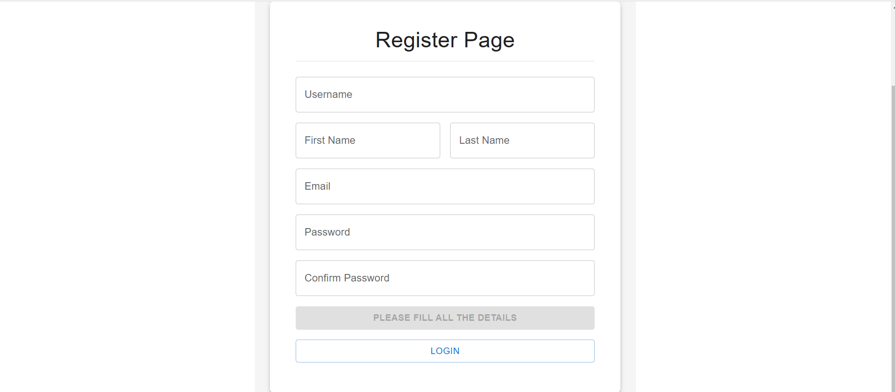

#Login
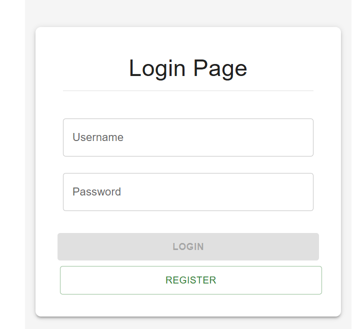

#Upload File
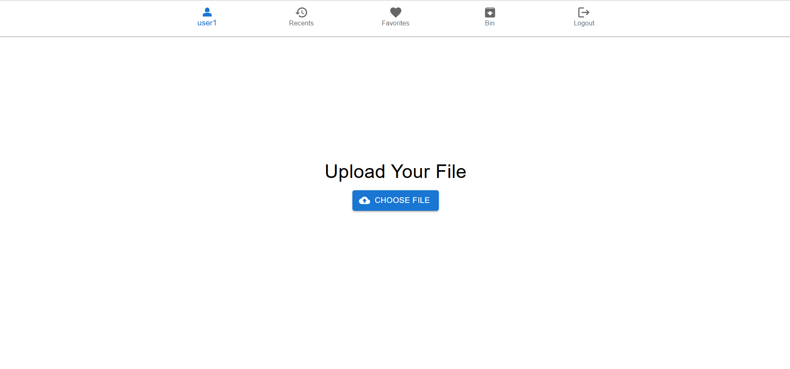

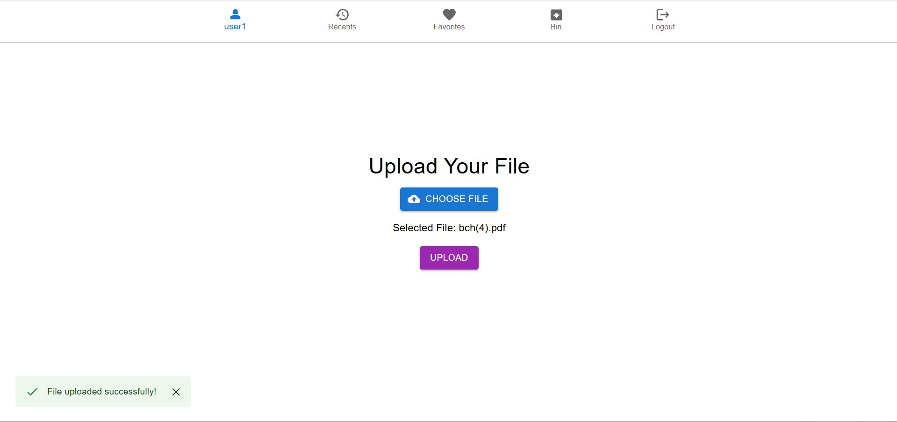

#Recents
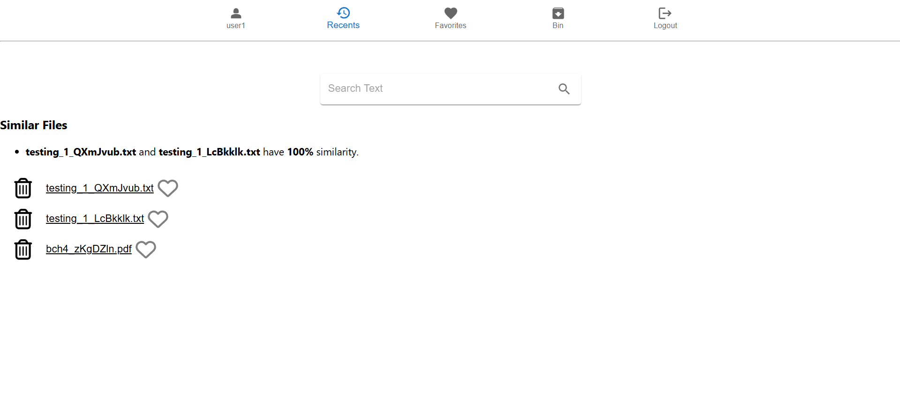

Search Text

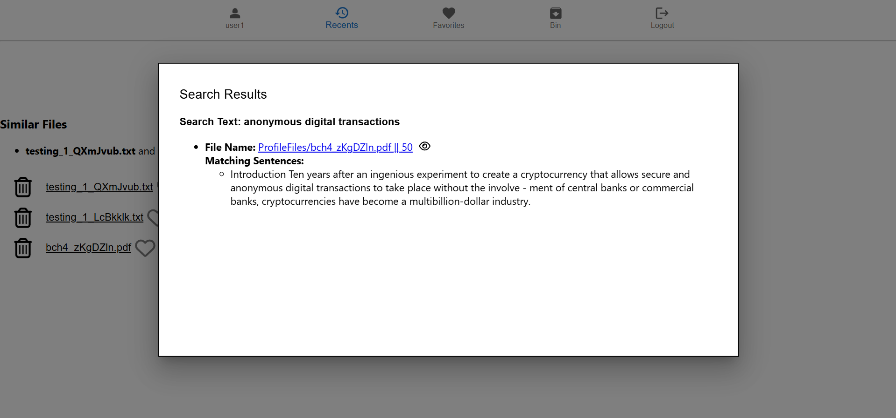

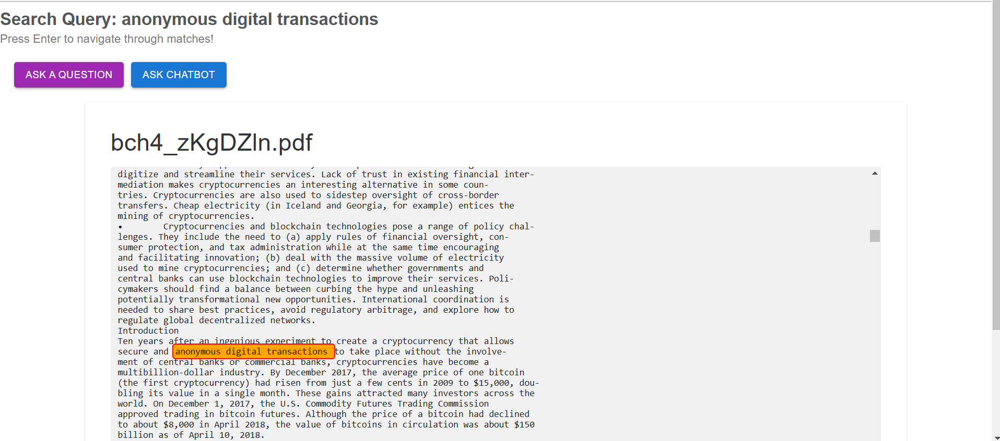

#Ask Question
qa_pipeline = pipeline("question-answering", model="distilbert-base-cased-distilled-squad")
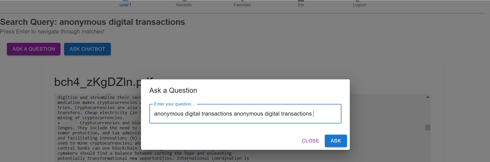

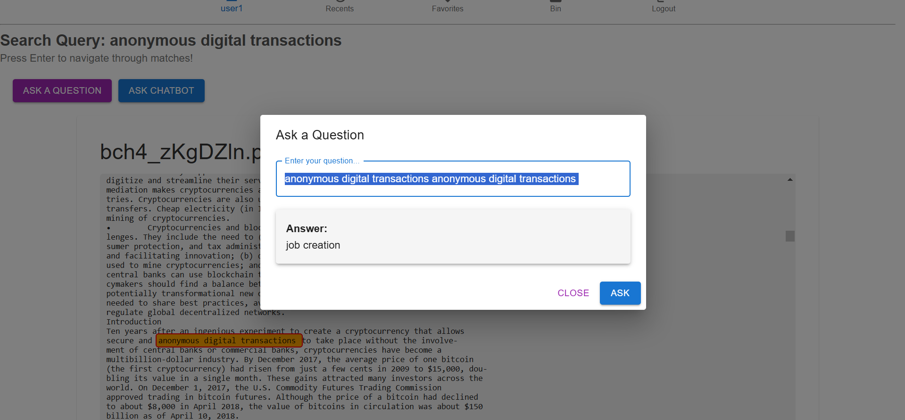

#Ask Question Chatbot
tokenizer = AutoTokenizer.from_pretrained("microsoft/DialoGPT-medium")
model = AutoModelForCausalLM.from_pretrained("microsoft/DialoGPT-medium")

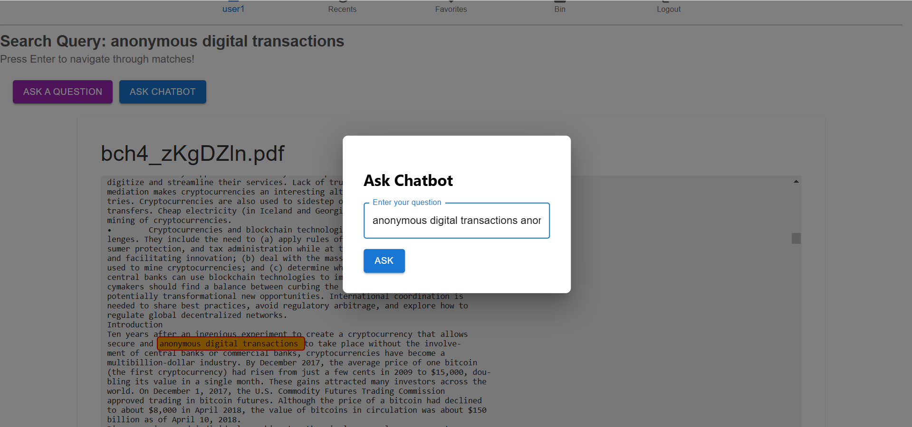

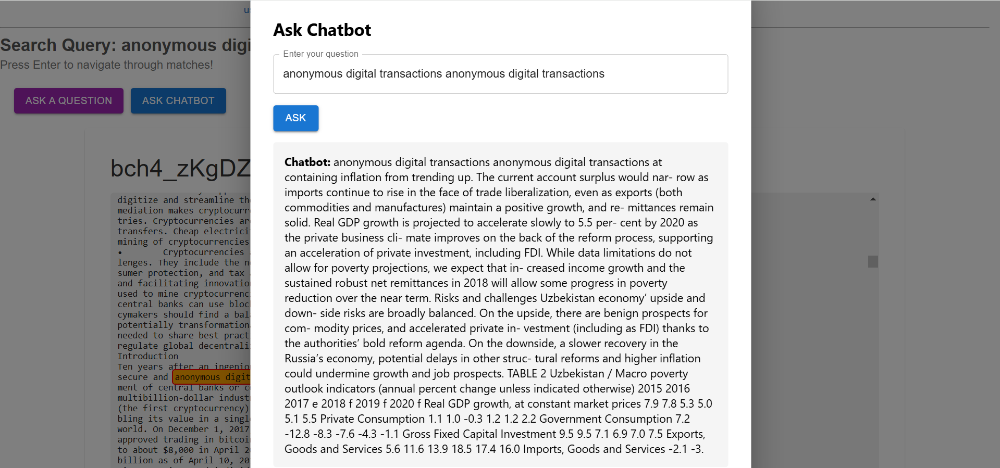

#Favourites
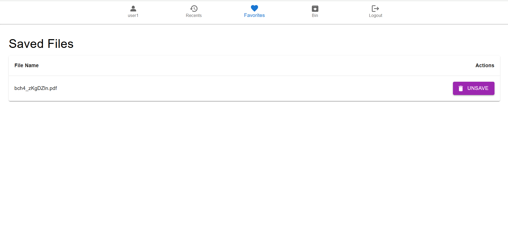

#Bin
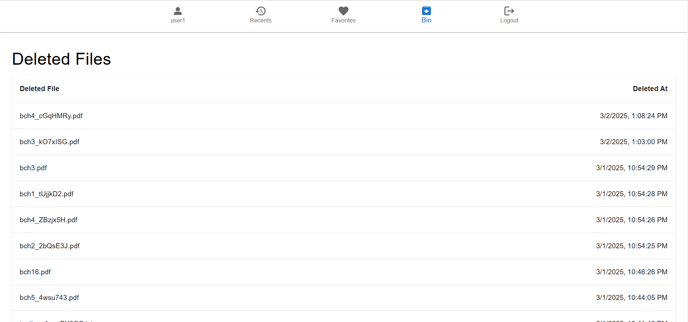
